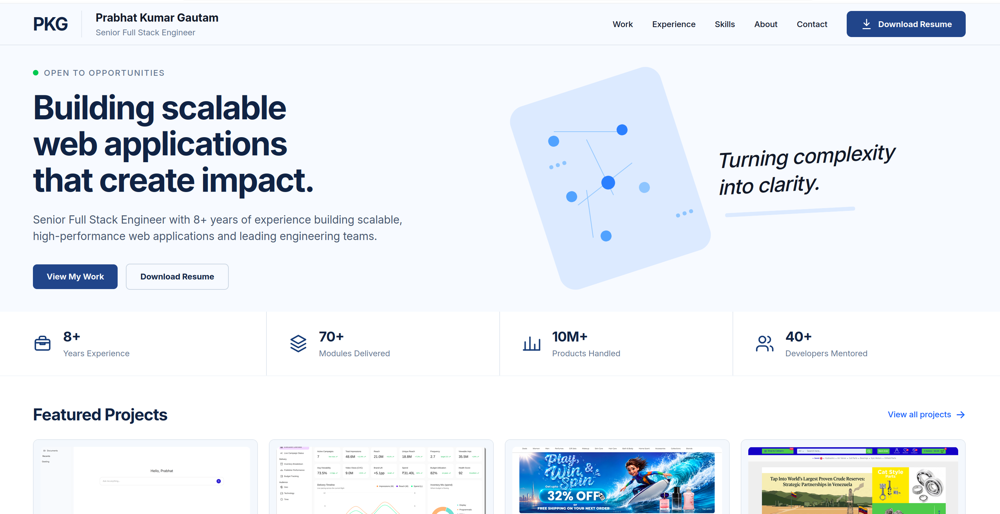

# Prabhat Kumar Gautam — Portfolio

Personal portfolio website showcasing my professional experience, technical skills, selected projects, and career journey as a Senior Full Stack Engineer.

## 🌐 Live Portfolio

[Visit Portfolio](https://portfolio-prabhat-projects1.vercel.app/)

## ✨ Features

- Responsive portfolio website for desktop and mobile
- Home page summarizing professional experience, skills, achievements, and featured projects
- Dedicated pages for:
  - Work
  - Experience
  - Skills
  - About
  - Contact
- Responsive mobile navigation with sidebar menu
- Downloadable resume
- Contact section with email, phone, LinkedIn, and GitHub
- Featured project showcase
- Clean and minimal user interface
- Responsive design across different screen sizes

## 🛠️ Tech Stack

- React
- TypeScript
- Vite
- Tailwind CSS
- React Router

## 📸 Screenshot



## 🚀 Getting Started

### Prerequisites

Make sure you have the following installed:

- Node.js
- npm

### Installation

```bash
git clone <repository-url>
cd <project-folder>
npm install
```
